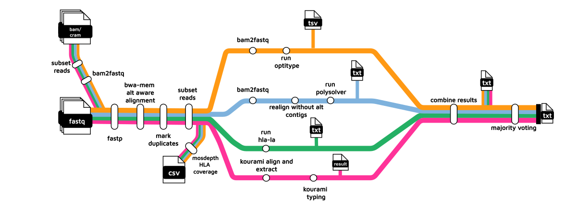

# nf-hlamajority



## Background

This pipeline is an implementation of a majority voting approach for the prediction of MHC Class I genotypes from DNA sequencing data. This approach was proposed by Claeys et al 2023 based on their benchmarking study. `nf-hlamajority` takes paired-end DNA-sequencing data and runs four tools:

- Optitype
- Polysolver
- Kourami
- HLA-LA

The MHC genotypes predicted by the highest number of tools is chosen.

## Usage

Clone the repository

```bash
git clone https://github.com/kevinpryan/nf-hlamajority.git
```

The pipeline accepts the following input file types:

- FASTQ
- Aligned BAM
- CRAM

It is designed for paired-end sequencing data.

Prepare a samplesheet with your input data that looks as follows:

**samplesheet.csv**

```csv
sample,fastq_1,fastq_2
SAMPLE1,SAMPLE1_S1_L002_R1_001.fastq.gz,SAMPLE1_S1_L002_R2_001.fastq.gz
SAMPLE2,SAMPLE2_S1_L003_R1_001.fastq.gz,SAMPLE2_S1_L003_R2_001.fastq.gz
SAMPLE3,SAMPLE3_S1_L004_R1_001.fastq.gz,SAMPLE3_S1_L004_R2_001.fastq.gz
```

or if you are using an aligned data type (BAM, CRAM), prepare the samplesheet as follows:

```csv
sample,aln
SAMPLE1,SAMPLE1.bam
SAMPLE2,SAMPLE2.cram
```

When using aligned data, you can provide a samplesheet containing both BAM and CRAM files. They do not need to be sorted or indexed.

You must pass the `--aligned` flag when using BAM or CRAM files as input.

When using CRAM files, you must pass the reference fasta used to generate the CRAM file via the `--cram_fasta` parameter. The pipeline only supports one `--cram_fasta` per run.

The script `install_references.sh` must be run before running the pipeline for the first time. The script should be run from **within** the `bin` directory.

The script takes an argument which is a directory (which must exist) where you can download the singularity images to be used to build/download the references.

```bash
cd bin
bash install-references.sh --engine <docker,singularity> --cache /path/to/singularity/cache/dir/
```

`--cache` is only required when using singularity.

A local test of `install-references.sh` on a SLURM HPC using singularity took 1 hour 40 minutes to run, and required approximately 33.4 GB of RAM. This reference is static and can be reused across genotyping runs.

Your references directory should have the following structure:

```bash
references/
├── bwakit
│   ├── hs38DH.fa
│   ├── hs38DH.fa.alt
│   ├── hs38DH.fa.amb
│   ├── hs38DH.fa.ann
│   ├── hs38DH.fa.bwt
│   ├── hs38DH.fa.pac
│   └── hs38DH.fa.sa
├── hla-la
│   ├── PRG_MHC_GRCh38_withIMGT
│   └── PRG_MHC_GRCh38_withIMGT.tar.gz
└── kourami
    ├── build.xml
    ├── db
    ├── LICENSE
    ├── pom.xml
    ├── preprocessing.md
    ├── README.md
    ├── resources
    ├── scripts
    └── src
```
When you have installed and built the required references, run the pipeline with:

*for FASTQ input*

```bash
nextflow run main.nf \
       --samplesheet <SAMPLESHEET> \
       --outdir <OUTDIR> \
       -profile <singularity/cluster/.../institute>
```

*for BAM input*

```bash
nextflow run main.nf \
       --samplesheet <SAMPLESHEET> \
       --outdir <OUTDIR> \
       --aligned \
       -profile <singularity/cluster/.../institute>
```

*for aligned input including at least one CRAM*

```bash
nextflow run main.nf \
       --samplesheet <SAMPLESHEET> \
       --outdir <OUTDIR> \
       --aligned \
       --cram_fasta \
       -profile <singularity/cluster/.../institute>
```

By default, the pipeline uses the majority voting method proposed by Claeys et al, whereby each tool gets one vote and the genotype with the most votes is assigned. In the case of a tie, the genotype of the best-performing tool in the benchmark is assigned (`--voting_method majority`).

An alternative is to carry out a weighted vote (`--voting_method weighted`). By default, the pipeline uses the accuracy scores for each tool in the Claeys et al benchmark (for each HLA gene) as the weight (`assets/benchmarking_results_claeys_cleaned.csv`). The user can specify their own weights by providing their own csv file to `--weights` in the following format:

```bash
tool,A,B,C
hlala,0.899,0.972,0.962
kourami,0.834,0.761,0.796
optitype,0.98,0.976,0.984
polysolver,0.949,0.918,0.98
```
so for example

*for FASTQ output using weighted voting with the default weights:*

```bash
nextflow run main.nf \
       --samplesheet <SAMPLESHEET> \
       --outdir <OUTDIR> \
       --voting_method weighted \
       -profile <singularity/cluster/.../institute>
```

Whatever method is used, the following cross-sample output files are expected:

```bash
├── nf_hlamajority_all_calls_sorted.tsv
├── nf_hlamajority_depth_sorted.tsv
├── nf_hlamajority_stats_combined_sorted.tsv
└── nf_hlamajority_votes_combined_sorted.tsv
```

*nf_hlamajority_all_calls_sorted.tsv*

*nf_hlamajority_depth_sorted.tsv*

*nf_hlamajority_stats_combined_sorted.tsv*

*nf_hlamajority_votes_combined_sorted.tsv*

## Dependencies

The pipeline requires the following:

- nextflow
- singularity or docker

## References

Claeys, A., Merseburger, P., Staut, J., Marchal, K., & van den Eynden, J. (2023). Benchmark of tools for in silico prediction of MHC class I and class II genotypes from NGS data. BMC Genomics, 24(1), 1–14. https://doi.org/10.1186/s12864-023-09351-z
