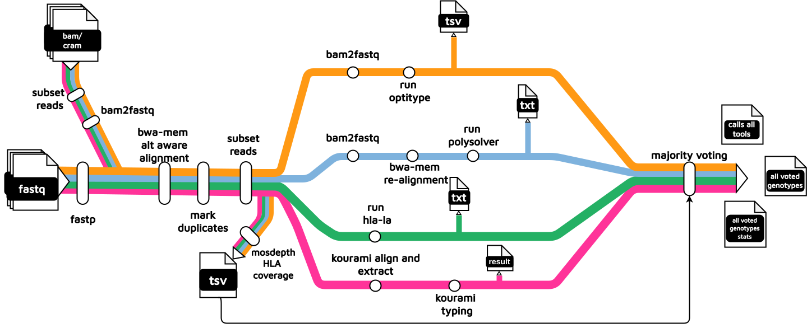

# nf-hlamajority



[](https://doi.org/10.5281/zenodo.19925526)

## Background

nf-hlamajority is a Nextflow pipeline for HLA class I genotyping from DNA sequencing data, including whole-exome sequencing (WES) and whole-genome sequencing (WGS). It implements the consensus voting strategy described by Claeys et al. (2023), combining four HLA class I genotyping tools into a single reproducible workflow. The pipeline also provides sequencing depth summaries and optional weighted voting.

The pipeline combines four HLA class I genotyping tools:

- Optitype
- Polysolver
- Kourami
- HLA*LA

For each gene (HLA-A, B, C), the HLA genotype predicted by the highest number of tools is selected.

## Quick start

### Clone the repository

```bash
git clone https://github.com/kevinpryan/nf-hlamajority.git
```

### Build references

```bash
nextflow run main.nf \
             --build_references \
             --outdir <PIPELINE_LOGS_OUTDIR> \
             -profile <singularity/docker/awsbatch>
```

### Optional: install Novoalign
To enable the Polysolver subworkflow, place the user-provided Novoalign binary and license in `bin`

```bash
cp novoalign bin
cp novoalign.lic bin
```

### Test installation

The test profile does not require user-provided input files.

```bash
nextflow run main.nf \
       --outdir <OUTDIR> \
       -profile <test_paired,singularity/docker/awsbatch>
```

### Prepare your samplesheet

Example `samplesheet.csv`

```csv
sample,fastq_1,fastq_2
SAMPLE1,/path/to/SAMPLE1_S1_L002_R1_001.fastq.gz,/path/to/SAMPLE1_S1_L002_R2_001.fastq.gz
SAMPLE2,/path/to/SAMPLE2_S1_L003_R1_001.fastq.gz,/path/to/SAMPLE2_S1_L003_R2_001.fastq.gz
SAMPLE3,/path/to/SAMPLE3_S1_L004_R1_001.fastq.gz,/path/to/SAMPLE3_S1_L004_R2_001.fastq.gz
```

### Run on your own data

```bash
nextflow run main.nf \
       --samplesheet samplesheet.csv \
       --outdir <OUTDIR> \
       -profile <singularity/docker/awsbatch>
```

## Dependencies

The pipeline requires:
- Nextflow (DSL2)
- Singularity/Apptainer or Docker
- Java (compatible with your Nextflow version)
- Novoalign (recommended; required for the Polysolver subworkflow)
- Novoalign license if using a licensed version

## Scope

nf-hlamajority currently supports consensus HLA class I genotyping from DNA sequencing data. It does not implement HLA class II typing or RNA-seq based HLA genotyping.

## Detailed usage
### Build references

`--build_references` triggers a parallel workflow to build references, which is a prerequisite to running the pipeline. `--outdir` is the desired pipeline log directory. The references will be placed in a directory called `references`, i.e. `nf-hlamajority/references`.

```bash
nextflow run main.nf \
             --build_references \
             --outdir <PIPELINE_LOGS_OUTDIR> \
             -profile <singularity/docker/awsbatch>
```

Reference building performs the following steps:

- Download the Polysolver reference
- Download the BWAkit reference genome
- Download the Kourami reference
- Build Kourami database
- Download HLA*LA reference
- Compute HLA*LA graph index structure
- Index reference FASTAs from BWAkit, Kourami, HLA*LA, and Polysolver

A local test of the reference building workflow on a SLURM HPC using Singularity took 2 hours 48 minutes to run, and required a maximum of 33.4 GB of RAM. These references are static and can be reused across genotyping runs.

Your references directory should have the following structure:

```bash
references
├── bwakit
│   ├── hs38DH.fa
│   ├── hs38DH.fa.alt
│   ├── hs38DH.fa.amb
│   ├── hs38DH.fa.ann
│   ├── hs38DH.fa.bwt
│   ├── hs38DH.fa.pac
│   └── hs38DH.fa.sa
├── hla-la
│   └── PRG_MHC_GRCh38_withIMGT
├── kourami
│   ├── build.xml
│   ├── custom_db
│   ├── LICENSE
│   ├── pom.xml
│   ├── preprocessing.md
│   ├── README.md
│   ├── resources
│   ├── scripts
│   ├── src
│   └── target
└── source
    └── IMGTHLA
```

Once the references have been built, you are ready to run nf-hlamajority.

### Running nf-hlamajority

The pipeline accepts the following input file types:

- FASTQ
- Aligned BAM
- CRAM

It is designed for paired-end DNA sequencing data, but will also accept single-end data. With single-end input, only Optitype is supported; the remaining tools require paired-end data.

#### Novoalign installation

`nf-hlamajority` can be run without Novoalign; however, we strongly recommend providing Novoalign to enable the complete four-tool consensus workflow described by Claeys et al. The Polysolver subworkflow requires Novoalign for alignment preprocessing.

To enable Polysolver:

1. Go to the [Novocraft website](https://www.novocraft.com/support/download/)
2. Download your desired version of Novocraft.
3. Decompress the tar archive and place the `novoalign` binary in the `bin` directory of nf-hlamajority.
4. If using a version of Novoalign that requires a license, place your Novoalign license (`novoalign.lic`) in the `bin`.

If Novoalign is not detected, the pipeline will skip the Polysolver subworkflow and continue using the remaining available HLA genotyping tools. The final consensus call will therefore be based on fewer tools.

#### Test data

To ensure the pipeline is working as expected, one of the test profiles (`test`, `test_paired`, or `test_single_end`) should be run first. `--outdir` is the directory where the `nf-hlamajority` results will be stored.

```bash
nextflow run main.nf \
       --outdir <OUTDIR> \
       -profile <test/test_paired/test_single_end,singularity/docker/awsbatch>
```

The test sample is 1000 Genomes NA12878. The CRAM file (316 MB) is provided through the [HLA*LA GitHub repository](https://github.com/DiltheyLab/HLA-LA/tree/master). The FASTQs are hosted on [Zenodo](https://zenodo.org/records/21342551). `test_single_end` is simply `test_paired` but excluding read 2.

The expected outputs of each tool from the test dataset can be found at:

- `assets/test-outputs/test-outputs-1000genomes/NA12878/` (profile `test`)
- `assets/test-outputs/test-outputs-1000genomes/NA12878_paired/` (profile `test_paired`)
- `assets/test-outputs/test-outputs-1000genomes/NA12878_single_end/` (profile `test_single_end`)

#### Running on full datasets
       
Prepare a samplesheet with your input data that looks as follows:

**samplesheet.csv**

```csv
sample,fastq_1,fastq_2
SAMPLE1,SAMPLE1_S1_L002_R1_001.fastq.gz,SAMPLE1_S1_L002_R2_001.fastq.gz
SAMPLE2,SAMPLE2_S1_L003_R1_001.fastq.gz,SAMPLE2_S1_L003_R2_001.fastq.gz
SAMPLE3,SAMPLE3_S1_L004_R1_001.fastq.gz,SAMPLE3_S1_L004_R2_001.fastq.gz
```

If your data is single-end:

```csv
sample,fastq_1,fastq_2
SAMPLE1,SAMPLE1_S1_L002_R1_001.fastq.gz,
SAMPLE2,SAMPLE2_S1_L003_R1_001.fastq.gz,
SAMPLE3,SAMPLE3_S1_L004_R1_001.fastq.gz,
```

If an empty fastq_2 column is not provided, this will cause the pipeline to fail.

You can provide a mixture of single-end and paired-end samples:

```csv
sample,fastq_1,fastq_2
SAMPLE1,SAMPLE1_S1_L002_R1_001.fastq.gz,SAMPLE1_S1_L002_R2_001.fastq.gz
SAMPLE2,SAMPLE2_S1_L003_R1_001.fastq.gz,
SAMPLE3,SAMPLE3_S1_L004_R1_001.fastq.gz,SAMPLE3_S1_L004_R2_001.fastq.gz
```

If you are using an aligned data type (BAM, CRAM), prepare the samplesheet as follows:

```csv
sample,aln
SAMPLE1,SAMPLE1.bam
SAMPLE2,SAMPLE2.cram
```

You must pass the `--aligned` flag when using BAM or CRAM files as input.

When using aligned data, you can provide a samplesheet containing both BAM and CRAM files. They do not need to be sorted or indexed; coordinate sorting is performed internally.

When using CRAM files, you must pass the reference fasta used to generate the CRAM file via the `--cram_fasta` parameter. The pipeline only supports one `--cram_fasta` per run. Therefore all CRAMs in a run must have been aligned to the same reference genome.

*for FASTQ input*

```bash
nextflow run main.nf \
       --samplesheet <SAMPLESHEET> \
       --outdir <OUTDIR> \
       -profile <singularity/docker/awsbatch>
```

*for BAM input*

```bash
nextflow run main.nf \
       --samplesheet <SAMPLESHEET> \
       --outdir <OUTDIR> \
       --aligned \
       -profile <singularity/docker/awsbatch>
```

*for aligned input including at least one CRAM*

```bash
nextflow run main.nf \
       --samplesheet <SAMPLESHEET> \
       --outdir <OUTDIR> \
       --aligned \
       --cram_fasta \
       -profile <singularity/docker/awsbatch>
```

#### Majority voting (default)

By default, the pipeline uses the majority voting method proposed by Claeys et al, whereby each tool gets one vote, and the genotype with the most votes is assigned. In the case of a tie, the genotype of the best-performing tool in the benchmark is assigned (`--voting_method majority`).

#### Weighted voting (optional)
An alternative is to carry out a weighted vote (`--voting_method weighted`). By default, the pipeline uses the accuracy scores for each tool in the Claeys et al benchmark (for each HLA gene) as the weight (`assets/benchmarking_results_claeys_cleaned.csv`). Weighted voting prioritises tools that demonstrated higher per-gene accuracy in the Claeys et al. benchmark, allowing higher-confidence calls to dominate in cases of disagreement.

The user can specify their own weights by providing their own CSV file to `--weights` in the following format:

```bash
tool,A,B,C
hlala,0.899,0.972,0.962
kourami,0.834,0.761,0.796
optitype,0.98,0.976,0.984
polysolver,0.949,0.918,0.98
```
so for example

*for FASTQ output using weighted voting with the default weights:*

```bash
nextflow run main.nf \
       --samplesheet <SAMPLESHEET> \
       --outdir <OUTDIR> \
       --voting_method weighted \
       -profile <singularity/docker/awsbatch>
```

### Example outputs

Regardless of the voting method, the pipeline produces the following cross-sample reports:

```bash
├── nf_hlamajority_votes_combined_sorted.tsv (summary table of assigned HLA genotypes)
├── nf_hlamajority_all_calls_sorted.tsv (HLA calls for each tool for each sample)
├── nf_hlamajority_depth_sorted.tsv (Mosdepth coverage)
├── nf_hlamajority_stats_combined_sorted.tsv (detailed information about voting, confidence scores, and assigned genotypes)
└──nf_hlamajority_status_sorted.tsv (per-sample summary of status of each tool: SUCCESS, TOOL_FAILURE, SKIP_SINGLE_END)
```

Example outputs can be found [here](https://github.com/kevinpryan/nf-hlamajority/tree/dev-kevin/assets/test-profiles/test_paired/combined_results).


## Integration with Landscape of Effective Neoantigens Software (LENS)

Instructions for running nf-hlamajority as part of the LENS neoantigen prediction pipeline can be found at `docs/lens-hlamajority/`.

 ## Important Licensing Information

This pipeline is licensed under the MIT license. However, it is designed to be run with a Docker/Singularity container that includes the POLYSOLVER software. The use of this specific POLYSOLVER container is subject to its own licensing terms, which are more restrictive.

As per the POLYSOLVER license:

- Academic and Non-Profit Use: The container is available for academic and non-profit users.
- Commercial Use: Commercial use of this pipeline with the provided POLYSOLVER container is prohibited unless you have first obtained a commercial license for Novoalign and any other applicable software within the container.

By using this pipeline, you are agreeing to comply with the licensing terms of all its software components. It is the user's responsibility to ensure they are licensed appropriately. For commercial use, please contact Novocraft Technologies to acquire a license for Novoalign.

## References

Claeys, A., Merseburger, P., Staut, J., Marchal, K., & van den Eynden, J. (2023). Benchmark of tools for in silico prediction of MHC class I and class II genotypes from NGS data. BMC Genomics, 24(1), 1–14. https://doi.org/10.1186/s12864-023-09351-z
