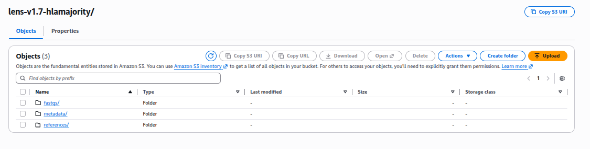

# Implementing LENS-hlamajority on AWS batch

The Landscape of Effective Neoantigens Software (LENS) pipeline can be found on GitLab [here](https://gitlab.com/reproducible-analyses-framework-and-tools/). To integrate `nf-hlamajority` into LENS, we made a mirror of the GitLab project containing LENS, which can be found [here](https://gitlab.com/healed-reproducible-analyses-framework-and-tools/). *LENS-hlamajority* was developed against `lens-v1.7-dev`. This fork is not automatically kept in sync with upstream LENS.

At the time *LENS-hlamajority* was developed, the use of LENS using cloud-based service providers, such as AWS Batch and Google Cloud Compute, was an experimental feature. This requires the user to download and build the references locally and then upload them to their S3 bucket (if using AWS) or a Google Cloud storage bucket manually.

To facilitate running *LENS-hlamajority* within this experimental framework, we developed custom bash scripts. These are designed for implementing LENS on AWS Batch. Here we provide a set of instructions for running LENS (with *nf-hlamajority*) on AWS Batch. 

## Overview of the workflow

Running *LENS-hlamajority* on AWS Batch involves three components:

1. **Local setup (EC2 instance)**
   - Build *nf-hlamajority* references
   - Install Reproducible Analyses Framework and Tools (RAFT) and initialise LENS

2. **S3 storage**
   - FASTQs
   - manifests
   - *LENS* + *nf-hlamajority* references
   - Nextflow work + results

3. **AWS Batch execution**
   - Nextflow submits jobs via RAFT-generated config

The general workflow is:
1. Build references locally
2. Upload references to S3
3. Configure AWS + Nextflow
4. Launch LENS via helper scripts

It is recommended to run the local setup steps on an AWS EC2 instance that has access to the S3 filesystem that will be used to store the references, FASTQs, etc.

## Workflow

Prerequisites: git, Nextflow, singularity/apptainer, pip.

An EC2 instance with at least 100 GB of available disk space and 32–64 GB RAM is recommended for reference construction steps.

### Step 1 

Set up AWS Batch to work with Nextflow. This can be done by following the [set of articles by Evan Foden](https://seqera.io/blog/nextflow-and-aws-batch-inside-the-integration-part-1-of-3/)

### Step 2

Create an EC2 instance on AWS and install Nextflow. Note: this instance must have the storage space to temporarily hold the references necessary for running LENS, (~72 GB).

### Step 3

Install RAFT from `pip` using the instructions at [uselens.io](uselens.io). RAFT is a wrapper used to set up LENS projects, written in Python.
  
```{bash}
pip install --user reproducible-analyses-framework-and-tools
```


Initiate a RAFT instance

```{bash}
raft.py setup --default
```

**Note** at the time of writing, the main LENS GitLab repository is undergoing some changes. To avoid errors when setting up your RAFT instance, after setting up your RAFT instance, edit the `nextflow_subgroups` of the hidden `.raft.cfg` file, found in the directory from which you ran `raft.py setup --default`:

*Default .raft.cfg*

```
{
    "filesystem": {
        "projects": "/mnt/data/test-lens-install-1.7/projects",
        "references": "/mnt/data/test-lens-install-1.7/references",
        "fastqs": "/mnt/data/test-lens-install-1.7/fastqs",
        "bams": "/mnt/data/test-lens-install-1.7/bams",
        "imgs": "/mnt/data/test-lens-install-1.7/imgs",
        "metadata": "/mnt/data/test-lens-install-1.7/metadata",
        "shared": "/mnt/data/test-lens-install-1.7/shared"
    },
    "nextflow_repos": {
        "nextflow_modules": "https://gitlab.com/reproducible-analyses-framework-and-tools/nextflow/modules"
    },
    "nextflow_subgroups": {
        "nextflow_module_subgroups": [
            "tools",
            "Projects",
            "Datasets"
        ]
    },
    "analysis_repos": {}
```

*Should be changed to*

```
cat .raft.cfg 
{
    "filesystem": {
        "projects": "/mnt/data/test-lens-install-1.7/projects",
        "references": "/mnt/data/test-lens-install-1.7/references",
        "fastqs": "/mnt/data/test-lens-install-1.7/fastqs",
        "bams": "/mnt/data/test-lens-install-1.7/bams",
        "imgs": "/mnt/data/test-lens-install-1.7/imgs",
        "metadata": "/mnt/data/test-lens-install-1.7/metadata",
        "shared": "/mnt/data/test-lens-install-1.7/shared"
    },
    "nextflow_repos": {
        "nextflow_modules": "https://gitlab.com/reproducible-analyses-framework-and-tools/nextflow/modules"
    },
    "nextflow_subgroups": {
        "nextflow_module_subgroups": [
            "tools",
            "Projects",
            "Datasets",
            "subworkflows",
            "workflows"
        ]
    },
    "analysis_repos": {}
```

This ensures RAFT fetches required workflow and subworkflow modules that are no longer included by default in upstream LENS.

### Step 4 

> **Run on EC2**

At the time of writing, the links to `Homo_sapiens_assembly38.dbsnp138.vcf.gz` and `Homo_sapiens.assembly38.fa` used by RAFT/LENS do not work. Run the following commands to download them from alternative sources. Run these commands from your `references` directory. The links used by RAFT to download `Homo_sapiens_assembly38.dbsnp138.vcf.gz` and `Homo_sapiens.assembly38.fa` do not tend to work, so they must be downloaded manually.

```
# run this from your references directory
mkdir -p homo_sapiens/vcfs; cd homo_sapiens/vcfs
wget https://storage.googleapis.com/gcp-public-data--broad-references/hg38/v0/Homo_sapiens_assembly38.dbsnp138.vcf # i.e. this is in references/homo_sapiens/vcfs
cd ../../homo_sapiens; mkdir -p fasta; cd fasta
wget -O Homo_sapiens.assembly38.fa https://storage.googleapis.com/gcp-public-data--broad-references/hg38/v0/Homo_sapiens_assembly38.fasta # this is in references/homo_sapiens/fasta
```

Run *LENS* in `setup-only` mode to download the rest of the references required to run LENS. Ensure you have singularity/apptainer in your path when you run this. You can use an empty dummy file for `--manifest` here, the file must exist within your `metadata/` directory.

```
cd metadata
touch dummy_metadata.tsv
cd ..
raft.py run-ots --project-id install-refs \
                  --workflow lens \
                  --version 1.7-dev \
                  --manifest dummy_metadata.tsv \
                  --species human \
                  --setup-only
```

### Step 5

Download *nf-hlamajority* from GitHub

```
git clone https://github.com/kevinpryan/nf-hlamajority.git
```

Run *nf-hlamajority* with the `--build_references` flag to download and install all necessary references. It is recommended to run this locally as opposed to using AWS Batch, as the script to upload the references to the S3 bucket is designed for this scenario (Step 8).

  ```{bash}
  nextflow run main.nf \
             --build_references \
             --outdir <PIPELINE_LOGS_OUTDIR> \
             -profile <singularity/docker/awsbatch/.../institute>
```

If you get an error downloading the `HLA*LA` data package but it worked previously, you can point to it using `--hla_la_prg_tar PATH/TO/HLA-LA-TAR`

This step requires ~33 GB RAM (peak usage during reference construction).

### Step 6

Set up your S3 bucket which will hold your fastqs, manifests (`metadata`), references, Nextflow work directories. It should look like this



```
lens-v1.7-hlamajority/
lens-v1.7-hlamajority/fastqs/cell-lines/rna
lens-v1.7-hlamajority/fastqs/cell-lines/wes
lens-v1.7-hlamajority/metadata/
lens-v1.7-hlamajority/references/
lens-v1.7-hlamajority/references/cloud/
```

Add a set of FASTQs to your `fastqs` directory. **Note:** When running on AWS Batch, all FASTQs must reside in a single directory. Generate a manifest using the instructions at [uselens.io](https://uselens.io/en/lens-v1.8/manifest.html). Add it to your `manifests` directory.

## Uploading references to S3

Two sets of references must be uploaded:

1. LENS references (from RAFT)
2. *nf-hlamajority* references

Helper scripts are provided for both. Both require permissions to upload to your S3 bucket; if you get a permission denied error, run `aws configure` to configure your IAM privileges.

### Step 7 

Upload LENS references to the S3 bucket, ensuring they are within the specified directory structure. 

```
bash upload-references-lens.sh 
--------------------------------------
SOURCE : antigen.garnish
DEST   : s3://healed-data/lens-v1.7-hlamajority/references/cloud/antigen.garnish/
--------------------------------------
--------------------------------------
SOURCE : homo_sapiens/annot
DEST   : s3://healed-data/lens-v1.7-hlamajority/references/cloud/
--------------------------------------
--------------------------------------
SOURCE : homo_sapiens/beds
DEST   : s3://healed-data/lens-v1.7-hlamajority/references/cloud/
--------------------------------------
--------------------------------------
SOURCE : homo_sapiens/binfotron
DEST   : s3://healed-data/lens-v1.7-hlamajority/references/cloud/binfotron/
--------------------------------------
--------------------------------------
SOURCE : homo_sapiens/cta_self
DEST   : s3://healed-data/lens-v1.7-hlamajority/references/cloud/
--------------------------------------
--------------------------------------
SOURCE : homo_sapiens/erv
DEST   : s3://healed-data/lens-v1.7-hlamajority/references/cloud/
--------------------------------------
--------------------------------------
SOURCE : homo_sapiens/fasta
DEST   : s3://healed-data/lens-v1.7-hlamajority/references/cloud/
--------------------------------------
--------------------------------------
SOURCE : homo_sapiens/lohhla
DEST   : s3://healed-data/lens-v1.7-hlamajority/references/cloud/
--------------------------------------
--------------------------------------
SOURCE : homo_sapiens/neosplice/peptidome.homo_sapiens
DEST   : s3://healed-data/lens-v1.7-hlamajority/references/cloud/peptidome.homo_sapiens/
--------------------------------------
--------------------------------------
SOURCE : homo_sapiens/protein
DEST   : s3://healed-data/lens-v1.7-hlamajority/references/cloud/
--------------------------------------
--------------------------------------
SOURCE : homo_sapiens/snaf/snaf-data
DEST   : s3://healed-data/lens-v1.7-hlamajority/references/cloud/snaf-data/
--------------------------------------
--------------------------------------
SOURCE : homo_sapiens/snpeff/GRCh38.GENCODEv37
DEST   : s3://healed-data/lens-v1.7-hlamajority/references/cloud/GRCh38.GENCODEv37/
--------------------------------------
--------------------------------------
SOURCE : homo_sapiens/starfusion/GRCh38_gencode_v37_CTAT_lib_Mar012021.plug-n-play
DEST   : s3://healed-data/lens-v1.7-hlamajority/references/cloud/GRCh38_gencode_v37_CTAT_lib_Mar012021.plug-n-play/
--------------------------------------
--------------------------------------
SOURCE : homo_sapiens/vcfs
DEST   : s3://healed-data/lens-v1.7-hlamajority/references/cloud/
--------------------------------------
--------------------------------------
SOURCE : mhcflurry
DEST   : s3://healed-data/lens-v1.7-hlamajority/references/cloud/mhcflurry/
--------------------------------------
--------------------------------------
SOURCE : viral
DEST   : s3://healed-data/lens-v1.7-hlamajority/references/cloud/
--------------------------------------
```

Your bucket should look something like this

```
lens-v1.7-hlamajority/references/
lens-v1.7-hlamajority/references/cloud/1000g_pon.hg38.vcf.gz
lens-v1.7-hlamajority/references/cloud/af-only-gnomad.hg38.vcf.gz
lens-v1.7-hlamajority/references/cloud/antigen.garnish
lens-v1.7-hlamajority/references/cloud/bedtools_2.28.0--hdf88d34_0.sif
lens-v1.7-hlamajority/references/cloud/binfotron
lens-v1.7-hlamajority/references/cloud/canonical_txs.mtec.norm.subcell.annot.tsv
lens-v1.7-hlamajority/references/cloud/cta.pirlygenes.25SEP2024.gene_list
lens-v1.7-hlamajority/references/cloud/erv_scores.25SEP2023.tsv
lens-v1.7-hlamajority/references/cloud/ervs_not_in_norm.peptides.tsv
lens-v1.7-hlamajority/references/cloud/gencode.v37.annotation.gff3
lens-v1.7-hlamajority/references/cloud/gencode.v37.annotation.gtf.gz
lens-v1.7-hlamajority/references/cloud/gencode.v37.annotation.with.hervs.gtf
lens-v1.7-hlamajority/references/cloud/gencode.v37.pc_translations.fa
lens-v1.7-hlamajority/references/cloud/GRCh38.GENCODEv37
lens-v1.7-hlamajority/references/cloud/GRCh38_gencode_v37_CTAT_lib_Mar012021.plug-n-play
lens-v1.7-hlamajority/references/cloud/hg38_bed_generator.sh
lens-v1.7-hlamajority/references/cloud/hg38_exome.bed
lens-v1.7-hlamajority/references/cloud/hla_fix.fasta
lens-v1.7-hlamajority/references/cloud/Homo_sapiens_assembly38.dbsnp138.vcf.gz
lens-v1.7-hlamajority/references/cloud/Homo_sapiens.assembly38.fa
lens-v1.7-hlamajority/references/cloud/Hsap38.geve.m_v1.gtf
lens-v1.7-hlamajority/references/cloud/Hsap38.txt
lens-v1.7-hlamajority/references/cloud/mhcflurry
lens-v1.7-hlamajority/references/cloud/nf-hlamajority
lens-v1.7-hlamajority/references/cloud/peptidome.homo_sapiens
lens-v1.7-hlamajority/references/cloud/small_exac_common_3.hg38.vcf.gz
lens-v1.7-hlamajority/references/cloud/snaf-data
lens-v1.7-hlamajority/references/cloud/somalier.sites.hg38.vcf.gz
lens-v1.7-hlamajority/references/cloud/virdetect.cds.gff
lens-v1.7-hlamajority/references/cloud/virus.cds.2024f2.fa
lens-v1.7-hlamajority/references/cloud/virus_masked_hg38.fa
lens-v1.7-hlamajority/references/cloud/virus_masked_mm10.fa
lens-v1.7-hlamajority/references/cloud/virus.pep.fa
```

### Step 8 

Upload *nf-hlamajority* references to the S3 bucket by running `scripts/upload-references/upload-references-hlamajority.sh` from within the `scripts/upload-references` directory. By default, the script runs a `--dryrun` so that you can ensure the upload will work as expected. Here is a snippet of the expected output of the dry run.

```
bash upload-references-hlamajority.sh
(dryrun) upload: references/source/IMGTHLA/wmda/README.md to s3://bucket-dir/references/cloud/nf-hlamajority/source/IMGTHLA/wmda/README.md
(dryrun) upload: references/source/IMGTHLA/wmda/hla_nom.txt to s3://bucket-dir/references/cloud/nf-hlamajority/source/IMGTHLA/wmda/hla_nom.txt
```

When the dry run has completed as expected, comment out the dry run and run the script again to upload the references.

### Step 9 

Now it is time to set up your LENS run. First you need to ensure your AWS secrets are setup on your EC2 instance as described [here](https://www.nextflow.io/docs/edge/secrets.html). `nextflow-for-aws-lens.config` assumes the following names for the secrets:

```
accessKey = secrets.MY_ACCESS_KEY
secretKey = secrets.MY_SECRET_KEY
```

### Step 10 

The following helper scripts are used:

- `01-lens-setup-script.sh` → prepares RAFT + Nextflow config
- `02-lens-nextflow-run-script.sh` → launches the pipeline
- `03-run-all.sh` → wrapper that runs both steps

Copy the scripts: 01-lens-setup-script.sh, 02-lens-nextflow-run-script.sh, 03-run-all.sh and nextflow-for-aws-lens.config to the directory containing your RAFT instance. 

First, make the following modifications to `nextflow-for-aws-lens.config`:

- line 4 - specify your AWS Batch queue name
- If you wish to run `netmhcpan`, `netmhcstabpan` and `netctlpan` as part of LENS, you must generate your own Docker image for each tool as described [here](https://gitlab.com/landscape-of-effective-neoantigens-software/nextflow/modules/tools/lens/-/wikis/Running-LENS#raft-installation) and populate  `nextflow-for-aws-lens.config` with the name of each image (lines 19, 26, 35)
- lines 83-87 specifies a different AWS Batch queue for the `whatshap_by_chr` process, as it tends to run out of disk space.
- line 99 - change awsregion if required
- lines 110 onwards - edit as desired 

03-run-all.sh arguments:

```
-p : project name
-m : manifest name (must exist on S3 under metadata/ots)
-r : absolute path to RAFT installation
-b : base path to S3 bucket (references at s3://<bucket>/references/cloud/)
```

`01-lens-setup-script.sh` runs RAFT in `--setup-only` mode, which pulls the required modules from GitLab and constructs the final nextflow config file, which will be named `nextflow-for-aws-lens-${LENS_PROJ_ID}-complete.config`. This config file will be found in a folder in your current directory. If you want to check the output of this script before running `02-lens-nextflow-run-script.sh`, comment out that portion of the script. 

Your `.nextflow.log`, along with all Nextflow trace files, is found in your project logs directory. All results and work directories will be found in your S3 bucket. 

## Verified versions

| Component          | Version            |
|-------------------|--------------------|
| LENS              | v1.7-dev   |
| RAFT              | v1.4.4             |
| nf-hlamajority    | commit f00ec51      |
| Nextflow          | 23.10.0          |
| apptainer  | 1.4.5  |

## AWS Batch Compute Environments

LENS-hlamajority is executed on AWS Batch using ECS-backed managed compute environments. No custom AMIs are required. All compute environments are based on the ECS‑Optimized Amazon Linux 2 AMI provided by AWS for the target region.


### Queues
Two AWS Batch queues are used:

- **Standard queue (1 TB disk, extended startup timeout)**  

   Default queue for the majority of Nextflow processes.

- **Large‑disk queue (2 TB disk)**  


  Used for the `whatshap_by_chr` process, where phasing is carried out in a parallelised, by‑chromosome manner. For each chromosome, the entire BAM file is copied to the instance. Although this is a low‑RAM process, it requires substantial disk space, which can otherwise result in excessive job packing and disk exhaustion on individual instances. A 2 TB root volume is used to prevent this.
